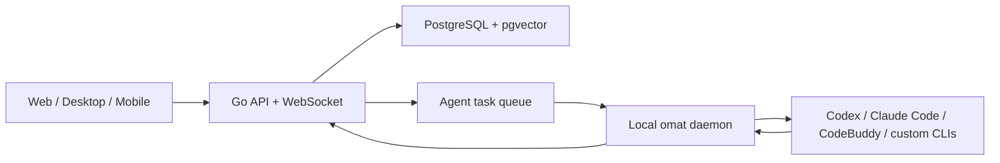

<div align="center">
  

  # OhMyAgentTeam

  **People, their agents, and other teams' agents working in one shared network.**

  A self-hostable collaboration workspace for planning outcomes, routing work,
  running local AI agents, and keeping human decisions in the loop.

  [](https://github.com/chenin0931/oh-my-agent-team/actions/workflows/ci.yml)
  [](LICENSE)

  **English | [简体中文](README.zh-CN.md)**
</div>


## Why OhMyAgentTeam

Most agent products are single-user chat boxes. Project-management products,
on the other hand, understand people and work but treat agents as external
automation. OhMyAgentTeam connects the two:

- **Agents are visible teammates.** They can own work, advise humans, subscribe
  to context, and report execution results in the same activity stream.
- **Humans stay accountable.** Assigning work to a person creates an Inbox item;
  their owned agents can add one-time advice without silently changing status.
- **Subscription is not execution.** An agent runs only after an explicit
  assignment, active-state transition, mention, or manual action.
- **Planning is separate from execution.** Planning Quick Create turns a goal
  into backlog work first. Moving executable work to `todo` starts delivery.
- **Every machine can be a runtime.** The `omat` daemon discovers supported
  local CLIs and makes them available to the team without moving their local
  credentials to the server.

## Product Model

```text
Workspace
├── Collaboration network
│   ├── My team (people, agents, squads)
│   └── Other members' teams
├── Projects
│   └── Epic (planning container)
│       └── Issue (independently executable outcome)
│           └── Subtask (bounded execution step)
└── Runtimes (Codex, Claude Code, CodeBuddy, and custom CLIs)
```

Agent participation has three explicit roles:

| Role | Purpose | May execute | May change status |
| --- | --- | --- | --- |
| Executor | Own and deliver an Issue or Subtask | Yes | Within its assigned active work |
| Advisor | Leave analysis or suggestions | No | No |
| Subscriber | Receive context and notifications | No | No |

Epic is a planning container. It can have an owner, health, dates, success
criteria, and progress, but it never starts an agent run.

## Highlights

- Project workspace with Overview, Backlog, Board, Roadmap, and Activity
- Epic, Issue, and Subtask hierarchy with backlog-first planning
- Planning Quick Create with content-aware routing to agents, squads, or people
- Unified work-item page for comments, agent advice, system events, and runs
- Human Inbox with deep links to the same collaboration page
- Collaboration network for your agents and other members' agent teams
- Local runtime daemon with Codex, Claude Code, CodeBuddy, and custom profiles
- Squads, reusable skills, recurring automations, attachments, and realtime sync
- Web, desktop, and mobile clients backed by the same API

## Quick Start

### Requirements

- Node.js 20+
- pnpm 10.28+
- Go 1.26+
- PostgreSQL 17 with pgvector, or Docker

### Run from source

```bash
git clone https://github.com/chenin0931/oh-my-agent-team.git
cd oh-my-agent-team
make dev
```

`make dev` prepares the environment, starts PostgreSQL, runs migrations, and
launches the Go API and Next.js app. Open `http://localhost:3000`.

### Build the CLI

```bash
make build
./server/bin/omat version
./server/bin/omat setup self-host
```

Release builds can be installed with:

```bash
curl -fsSL https://raw.githubusercontent.com/chenin0931/oh-my-agent-team/main/scripts/install.sh | bash
```

The CLI stores state in `~/.ohmyagentteam`. A previous installation is migrated
automatically the first time the new CLI loads its configuration.

## Architecture



| Layer | Technology |
| --- | --- |
| Web | Next.js 16, React, TanStack Query |
| Desktop | Electron |
| Mobile | Expo / React Native |
| Backend | Go, Chi, sqlc, WebSocket |
| Database | PostgreSQL 17, pgvector |
| Runtime | Local `omat` daemon and provider CLIs |

## Development

```bash
pnpm install
pnpm typecheck
pnpm test
cd server && go test ./...
```

See [CONTRIBUTING.md](CONTRIBUTING.md), [SELF_HOSTING.md](SELF_HOSTING.md), and
[CLI_AND_DAEMON.md](CLI_AND_DAEMON.md) for deeper workflows.

## Project Status

OhMyAgentTeam is under active development. APIs, migrations, desktop packaging,
and the collaboration model are evolving quickly. Use a dedicated database and
review release notes before upgrading production deployments.

## License And Upstream

This repository is a branded derivative of the upstream
[Multica project](https://github.com/multica-ai/multica). The upstream license is
a modified Apache 2.0 license with additional restrictions, including frontend
branding and hosted-service conditions. Those terms remain in force. Read
[LICENSE](LICENSE) and [NOTICE.md](NOTICE.md) before deploying or redistributing
the project.

OhMyAgentTeam is not affiliated with or endorsed by Multica, Inc.
