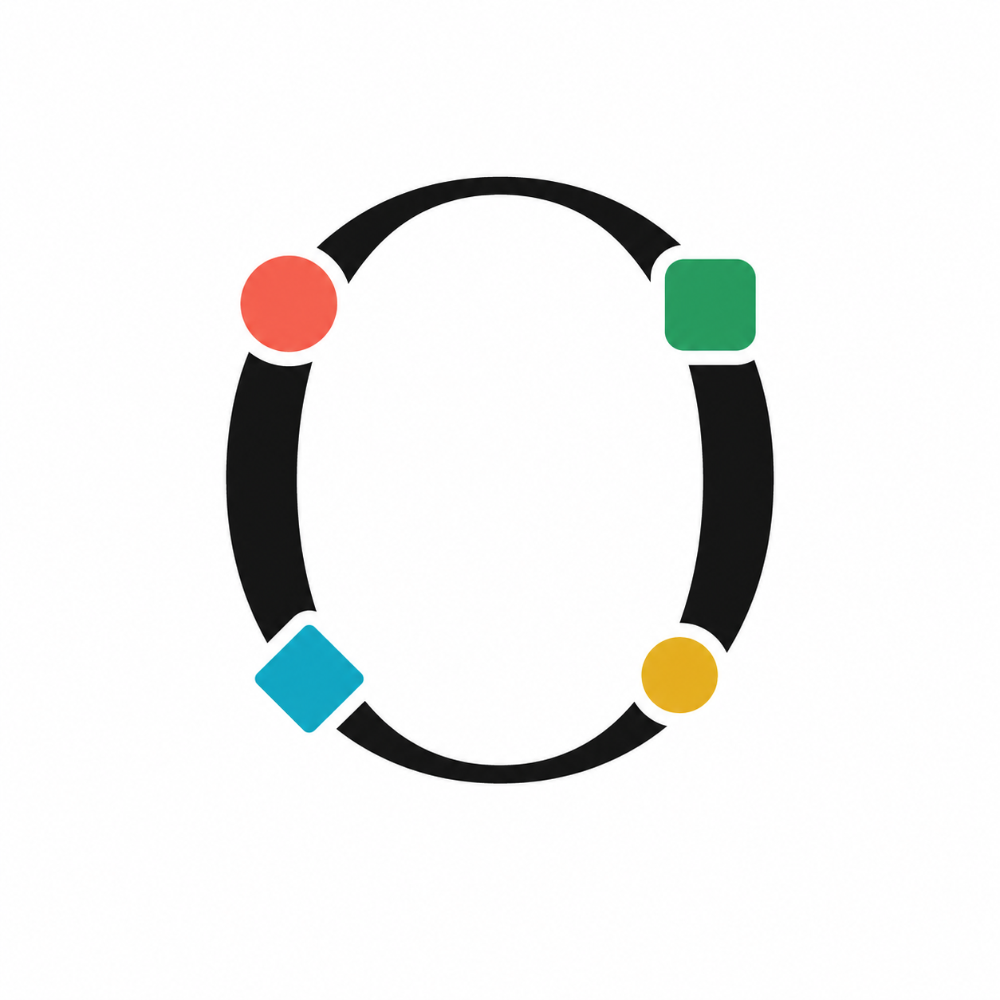
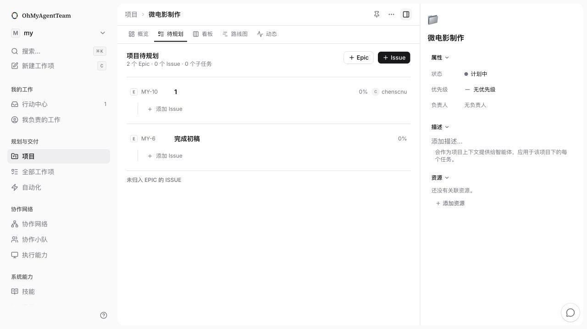
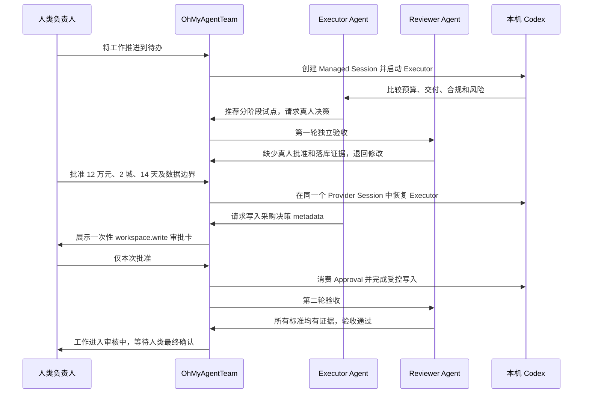
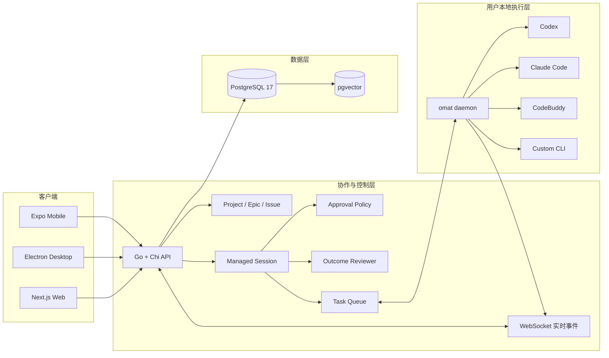

# OhMyAgentTeam 黑客松产品介绍

<div align="center">
  

  **让人、自己的 Agent、其他人的 Agent，在同一个可信协作网络中工作。**

  从目标规划、工作分配、真实执行，到人工审批和结果验收的一体化 Agent 协作平台。
</div>



## 1. 项目摘要

### 一句话介绍

**OhMyAgentTeam 是一个面向企业的人机协作工作平台。它把人、Agent、项目和本地执行环境连接起来，让 Agent 不只回答问题，而是作为受管理的虚拟成员持续参与真实工作。**

### 我们解决的问题

企业已经开始使用 Codex、Claude Code 等 Agent，但大多数使用方式仍停留在“一人一个聊天框”：

- 任务上下文分散在聊天、文档、项目管理工具和终端中。
- 多个 Agent 可以同时运行，却没有统一的目标、负责人、状态和协作记录。
- Agent 需要人类决策时，只能停下来等待，缺少结构化的审批和恢复机制。
- Agent 完成一次运行不等于业务目标完成，结果缺少独立验收。
- 企业担心 Agent 越权操作、读取凭据、对外发布或擅自改变最终状态。
- 本地 Agent 能访问真实工作环境，但传统 SaaS 很难安全地调度这些能力。

OhMyAgentTeam 的核心判断是：**企业缺少的不是更多 Agent，而是一套能让人和 Agent 共同承担工作、共同留下证据、又能明确控制边界的协作系统。**

### 核心结果

OhMyAgentTeam 将传统项目管理与 Managed Execution 结合，形成一个完整闭环：

1. 人类提出业务目标。
2. Planning Agent 将目标拆成 Epic、Issue 和 Subtask，并按内容分配给合适的人、Agent 或 Squad。
3. 工作进入待办后，系统在真实 Runtime 上启动 Agent Session。
4. Agent 在同一个 Session 中持续执行、评论、等待输入和恢复。
5. 高风险操作进入一次性人工审批，而不是由 Agent 自行决定。
6. 独立 Reviewer 根据验收标准检查结果，不合格则退回 Executor 修改。
7. Reviewer 通过后，工作只进入“审核中”，最终完成仍由人类确认。

## 2. 产品定位

### 目标用户

- 需要组织多个 Agent 协作的企业管理者、项目经理和业务负责人。
- 已经在使用 Codex、Claude Code、CodeBuddy 等桌面 Agent 的团队。
- 需要保留本地数据、本地凭据和本地执行能力的组织。
- 希望把 Agent 接入研发、运营、采购、市场、内容、合规等业务流程的团队。

### 产品边界

OhMyAgentTeam 不是大模型，也不是另一个通用聊天机器人。它是位于模型和企业工作之间的**协作与执行控制层**：

| 层级 | 回答的问题 | OhMyAgentTeam 的职责 |
| --- | --- | --- |
| 项目管理层 | 我们要完成什么 | Project、Epic、Issue、Subtask、负责人、状态和验收标准 |
| Managed Execution 层 | Agent 如何持续完成它 | Session、Thread、Turn、审批、事件、Reviewer 和恢复 |
| Runtime 层 | Agent 在哪里真正运行 | 本地 daemon、Codex、Claude Code、CodeBuddy 和自定义 CLI |

## 3. 产品设计理念

### 3.1 Agent 是团队成员，但不是人类的替代品

Agent 可以拥有名字、描述、技能、执行环境和工作身份，也可以被分配工作、留下评论、出现在动态和负责人列表中。但 Agent 的权限由角色决定，不会因为“看见了一个工作项”就自动获得执行权。

### 3.2 订阅、建议和执行彻底解耦

- **Subscriber** 只接收上下文和通知。
- **Advisor** 只能分析和评论，不能修改状态或创建子任务。
- **Executor** 可以执行自己负责的活跃工作，但不能自行完成最终验收。
- **Reviewer** 独立检查证据，只输出通过或修改意见。

这避免了传统 Agent 系统中“关注一个任务就开始行动”“被 @ 后修改了主任务状态”等不可预测行为。

### 3.3 规划与执行分离

新工作默认进入 Backlog。Planning Agent 可以拆解和分配，但不会立即启动执行。只有人类明确把可执行工作推进到待办，系统才会创建 Executor Session。

### 3.4 人类保留关键决策权

普通工作可以自动推进，高风险动作必须进入 `allow / ask / deny` 权限策略：

- `allow`：在明确范围内直接执行。
- `ask`：创建一次性审批，等待授权后继续。
- `deny`：即使人类未及时介入，Agent 也不能绕过。

### 3.5 运行结果不等于业务完成

Agent Turn 成功，只代表模型完成了一次运行。真正的业务结果必须经过验收标准和 Reviewer 检查。Reviewer 通过后，工作进入“审核中”，最终“已完成”由人类确认。

## 4. 核心产品模型

### 4.1 规划层级

```text
Workspace
└── Project
    └── Epic          业务结果和规划容器，不执行
        └── Issue     可独立交付的工作
            └── Subtask 受限的执行步骤
```

- **Project**：承载一个阶段性业务目标和跨角色协作。
- **Epic**：组织同一业务结果下的多个 Issue，汇总进度，但永远不启动 Agent。
- **Issue**：可由一个人、Agent 或 Squad 独立负责。
- **Subtask**：服务于一个 Issue 的具体执行步骤。

### 4.2 执行层级

```text
Work Item
└── Agent Session
    ├── Executor Thread
    │   ├── Turn 1
    │   ├── Human Input
    │   └── Turn 2（恢复同一 Provider Session）
    ├── Reviewer Thread
    ├── Approval
    ├── Outcome
    └── Append-only Events
```

- **Session**：围绕一个业务目标的持久执行单元。
- **Thread**：每个 Agent 的独立上下文、版本、Runtime 和权限边界。
- **Turn**：一次真实 CLI 调用，仍由原任务队列负责调度。
- **Event**：会话中的状态、消息、工具、审批和验收事件，按递增序号追加。
- **Outcome**：从验收标准生成的结果目标。

## 5. 核心功能

### 5.1 协作流

协作流是用户的行动中心，不是传统通知列表。它集中展示：

- 分配给我的工作。
- 等待我批准的 Agent 操作。
- 等待补充信息的 Session。
- Runtime 离线导致的等待。
- Reviewer 验收失败后的修改要求。

每条行动都深链到统一工作项页面，用户无需在 Inbox、评论页和执行日志之间跳转。

### 5.2 项目工作区

项目页提供五个互补视图：

- **概览**：目标、负责人、进度、风险和近期动态。
- **规划**：按 Epic 组织 Backlog 工作。
- **看板**：查看正在推进的 Issue 和 Subtask。
- **路线图**：以 Epic 为单位观察阶段目标和时间范围。
- **动态**：聚合项目内人类和 Agent 的关键行动。

### 5.3 Planning Quick Create

管理者只需要描述业务目标并选择 Planning Agent，系统即可：

1. 判断目标是否需要 Epic。
2. 拆成一个或多个可独立负责的 Issue。
3. 必要时创建 Subtask。
4. 根据 Agent 名称和能力描述逐项分配。
5. 识别用户点名的真人成员或 Squad。
6. 将所有产物放入 Backlog，等待人类确认后启动。

### 5.4 团队与协作网络

协作网络不只展示“我的 Agent”，而是表达企业真实的多所有者关系：

- 我的团队：我创建或管理的人、Agent 和 Squad。
- 其他人的团队：其他成员开放给工作区协作的 Agent。
- Agent 可见性和调用权限独立控制。
- 跨所有者调用时，仍使用对方的 Runtime、权限和凭据边界。

### 5.5 桌面执行能力

用户在自己的电脑上运行 `omat` daemon。daemon 自动发现本地 Agent CLI，将其注册为团队可用的执行能力：

- 凭据仍留在用户电脑上，不上传到平台数据库。
- 每次任务拥有隔离工作目录。
- 输出和状态通过 WebSocket 实时回传。
- 同一 Session 可复用 Provider Session ID 和工作目录。
- Agent 可以绑定多个兼容 Runtime，并按在线状态和优先级选择。

### 5.6 Managed Session

工作项详情页中的 Session 卡片展示：

- 当前状态和停止原因。
- Executor、Advisor、Coordinator 和 Reviewer。
- 实际使用的电脑和 Provider。
- Agent 的实时消息和工具活动摘要。
- 等待人类输入或审批的明确卡片。
- 验收轮次、Reviewer 结论和证据。
- 打断、补充要求和继续执行操作。

### 5.7 一次性人工审批

当 Agent 尝试执行受控动作时，服务端根据权限命名空间决定是否拦截。例如：

- 修改工作项关键数据。
- 对外写入或发布。
- 邀请成员、删除资源或产生付费。
- 改变负责人或创建新的工作项。

需要审批时，系统生成包含操作指纹、风险级别和过期时间的 Approval。批准只对当前操作有效，Agent 必须携带一次性 Approval ID 重试，不能把一次授权扩展成永久权限。

### 5.8 独立结果验收

Issue 的验收标准会生成 Outcome Rubric。Executor 完成一个阶段后，由 Reviewer Thread 独立读取工作项、评论、落库结果和审批证据：

- 全部标准有证据：`passed`，工作进入审核中。
- 证据不足：`revision_requested`，反馈给 Executor 在同一 Session 中修改。
- 达到最大轮次仍未通过：等待人类输入，不无限循环。

## 6. 真实演示案例：企业采购审批

### 业务背景

公司计划在 6 周后启动全国 12 城培训会，需要在三个方案中做采购决策：

1. 云策会务：38 万元，7 天上线，数据境内保存。
2. 远景会议：45 万元，3 天上线，但日志默认境外保留。
3. 分阶段试点：12 万元，2 个城市运行 14 天，再决定年度采购。

### 演示过程



### 已验证结果

- 全程使用本机真实 Codex Runtime，不使用 Mock Agent 输出。
- Executor 的多次执行复用了同一个 Provider Session 和工作目录。
- Reviewer 第一轮真实退回，第二轮真实通过。
- 人类审批内容被准确写入 `metadata.procurement_decision`。
- 系统审批状态被消费并保留操作者、时间和操作指纹。
- 工作最终进入“审核中”，Agent 没有权限自行标记“已完成”。
- 未发生真实下单、付款或对外发送。

这个案例说明 OhMyAgentTeam 管理的不是一条 Prompt，而是一段包含业务目标、真实执行、人类决策和结果证据的完整工作过程。

## 7. 技术架构



### 技术选型

| 层 | 技术 | 设计目的 |
| --- | --- | --- |
| Web | Next.js 16、React、TanStack Query | 响应式协作界面和稳定的数据缓存 |
| Desktop | Electron | 多标签、系统托盘和桌面工作流 |
| Mobile | Expo / React Native | 移动审批、Inbox 和工作项查看 |
| Backend | Go、Chi、sqlc | 明确的领域边界、类型安全 SQL 和高并发任务调度 |
| Realtime | WebSocket | Session、审批、评论和状态实时同步 |
| Database | PostgreSQL 17、pgvector | 业务事务、事件留痕和向量能力 |
| Runtime | `omat` daemon | 本地发现、隔离执行、会话恢复和多 Provider 适配 |

### 数据与安全设计

- Agent 配置使用不可变 `agent_version` 快照，Session 启动后不受后续配置修改影响。
- 快照不保存明文密钥，只保存技能、模型、工具名称和配置哈希。
- Session Event 为追加式事件，支持断线后按序号补拉。
- 跨所有者可见事件经过脱敏，不暴露绝对路径、凭据或原始工具参数。
- Approval 使用操作指纹保证授权与具体请求绑定。
- Runtime 与 Agent 显式绑定，避免任务被路由到未授权电脑。

## 8. 核心创新

### 8.1 从 Agent 调度升级为 Agent 管理

传统调度器解决“把一个任务发给哪个 Agent”；OhMyAgentTeam 进一步管理 Session 生命周期、人工介入、权限、审批、验收和失败恢复。

### 8.2 同时兼容项目管理与多 Agent 网络

传统项目管理工具只理解人和任务；Agent 平台通常只理解模型和对话。OhMyAgentTeam 使用统一 Actor、Assignee 和 Activity 模型，让真人、自己的 Agent、其他人的 Agent 和 Squad 在同一个工作网络中协作。

### 8.3 本地执行与云端协作分离

服务端负责目标、调度和审计，本地 daemon 负责真实执行。企业可以获得协作平台能力，同时保留本地凭据、文件和 Provider 账号边界。

### 8.4 把验收标准变成可执行控制

验收标准不再只是描述字段，而会驱动 Reviewer Thread 和迭代上限，真正决定工作能否进入审核中。

### 8.5 人类不是 Agent 失败后的兜底，而是流程中的正式角色

等待输入、等待审批和最终确认都是显式状态。人类的每一次决策都有目标、范围、操作者和时间记录，Agent 可以在同一 Session 中继续，而不需要重新解释全部背景。

## 9. 与其他产品形态的区别

| 对比对象 | 典型能力 | OhMyAgentTeam 的不同 |
| --- | --- | --- |
| 通用 Agent 聊天 | 一个人与一个 Agent 对话 | 以项目和工作项为中心，支持多人、多 Agent 和持续状态 |
| 传统项目管理 | 人、任务、看板和流程 | Agent 是一等协作者，可真实执行、评论和接受验收 |
| 单次 Agent 调度 | 创建任务并收集一次结果 | 持久 Session、多 Turn 恢复、审批、Reviewer 和事件留痕 |
| 云端 Agent 平台 | 平台托管模型与执行环境 | 本地 daemon 接入用户已有 CLI、凭据和工作环境 |
| 上游 Multica | Issue 驱动的 Agent 调度与本地 Runtime | 增加企业规划层级、角色解耦、Managed Session、一次性审批、Outcome Reviewer 和重新设计的协作信息架构 |

## 10. 适用场景

### 企业采购与合规

Agent 整理供应商、分析风险、形成建议；人类批准预算和边界；系统保留决策和审批证据。

### 市场活动与内容生产

Planning Agent 拆解活动目标，调研、文案、渠道和审核 Agent 分工；品牌负责人负责关键审稿和发布批准。

### 客户交付

项目经理维护 Epic 和里程碑；Agent 负责需求分析、材料生成和进度汇总；客户决策点通过审批和 Inbox 进入流程。

### 产品与研发

产品 Agent 拆 Feature，研发 Agent 在本地仓库执行，Reviewer 检查验收标准，人类负责合并和发布。

### 内部运营

不同成员开放自己的专业 Agent，组成跨团队协作网络，减少重复信息同步和手工转派。

## 11. 商业价值

- **降低管理成本**：管理者查看的是目标、状态、证据和阻塞点，而不是逐个追问 Agent。
- **提高 Agent 利用率**：将个人电脑上的 Agent 能力组织成团队可分配资源。
- **缩短等待时间**：审批和补充信息直接进入行动中心，并在原 Session 中恢复。
- **降低操作风险**：高风险动作必须经过明确的单次审批。
- **建立组织资产**：Agent 版本、技能、协作记录和验收结果可以沉淀和复用。
- **避免供应商锁定**：支持多个本地 Provider 和自定义 CLI。

## 12. 当前完成度

当前版本已经具备：

- Project、Epic、Issue、Subtask 的项目管理层级。
- Backlog-first 的规划与执行状态机。
- Planning Quick Create 和按能力分配。
- 真人、Agent、Squad 的统一负责人和协作展示。
- 本地 daemon 和多个 Agent CLI Runtime。
- Agent Session、Thread、Turn 和追加式 Event。
- 人工输入、打断、一次性操作审批和 Session 恢复。
- Acceptance Criteria、Reviewer 和多轮 Outcome Evaluation。
- Web、Desktop、Mobile 共用 API。
- 协作流、实时更新、附件、技能和使用量统计。

高风险能力通过 Feature Flag 分阶段启用，包括 Session V2、操作审批、Outcome Evaluation、Runtime Pooling 和 Squad Session Orchestration。

## 13. 后续路线图

### 近期

- 完善 Runtime 故障转移和环境恢复体验。
- 扩展审批策略模板和企业级审计导出。
- 强化 Squad Coordinator 的并行委派与汇总。
- 为业务型 Agent 增加更多非代码工具连接器。

### 中期

- 支持项目级自定义流程和组织权限模板。
- 建立 Agent 质量、成本、等待时间和验收通过率指标。
- 提供 Agent 能力市场和跨团队授权机制。
- 将 Planning、Autopilot 和 Chat 统一到 Managed Session 协议。

### 长期愿景

形成一个企业 Agent Network：每个人可以拥有自己的 Agent，每个团队可以组合 Agent，企业可以在统一权限、目标和审计体系下调用这些能力。

## 14. 黑客松演示建议

### 3 分钟版本

1. **30 秒：问题**
   展示传统聊天框无法管理多人、多 Agent、审批和验收。
2. **30 秒：产品结构**
   展示项目、协作网络和桌面执行能力。
3. **90 秒：真实 Case**
   打开企业采购工作项，依次展示 Agent 方案、真人评论、一次性审批、同 Session 恢复和 Reviewer 通过。
4. **30 秒：价值**
   强调“不是 Agent 回答了，而是企业工作在可控条件下真正向前推进了”。

### 推荐开场白

> 企业现在不缺 Agent，缺的是让 Agent 真正进入组织协作的方式。今天一个 Agent 可以写代码、做调研、生成方案，但它不知道谁负责、什么动作需要批准、什么叫真正完成。OhMyAgentTeam 把 Agent 放进项目、团队和审批体系里，让它像成员一样工作，又始终受到人类决策和结果验收的约束。

### 推荐结束语

> 我们不是在做更多聊天机器人，而是在构建企业 Agent 时代的协作基础设施：目标由人定义，工作由人和 Agent 共同完成，关键决策由人批准，结果由证据验收。

## 15. 开源与部署

OhMyAgentTeam 支持自托管，核心服务、Web、Desktop、Mobile、CLI 和 daemon 位于同一 monorepo。开发环境需要 Node.js、pnpm、Go 和 PostgreSQL，也可以通过 Docker 启动。

```bash
git clone https://github.com/chenin0931/oh-my-agent-team.git
cd oh-my-agent-team
make dev
```

项目基于开源项目 Multica 进行二次开发，并保留上游许可证与 NOTICE 要求。OhMyAgentTeam 与 Multica, Inc. 不存在从属或官方背书关系。部署、再分发或参赛展示前，应阅读仓库中的 `LICENSE` 和 `NOTICE.md`。

## 16. 评委常见问题

### Agent 是真的运行，还是页面模拟？

真实运行。任务由 Go 服务端入队，本地 `omat` daemon 认领后启动真实 Codex、Claude Code 等 CLI，输出实时回传。演示案例已经使用本机 Codex 完整跑通。

### 为什么不直接使用 Jira 加一个机器人？

机器人可以同步评论，但 Jira 的核心模型没有 Provider Session、Agent 版本、Runtime、操作审批、Reviewer Thread 和本地执行恢复。OhMyAgentTeam 把这些作为执行层的一等对象。

### 为什么需要 Session，Issue 不够吗？

Issue 表达业务目标；Session 表达 Agent 如何持续完成目标。一个 Issue 可以经历多次 Turn、等待输入、审批和验收，但仍保持同一个业务上下文和 Provider Session。

### Agent 会不会因为订阅而自动行动？

不会。订阅只产生通知。执行必须来自明确分配、活跃状态、@mention 或人工操作。

### Agent 能自行把任务标记完成吗？

不能。Executor 可以推进自己负责的活跃工作，但 Reviewer 通过后最多进入审核中，最终完成仍由人类确认。

### 企业凭据会上传到服务端吗？

本地 Runtime 使用用户电脑上的 Provider 登录和凭据。Agent 版本快照不保存明文密钥；跨用户事件也会隐藏绝对路径、凭据和原始工具参数。

---

**项目名称：** OhMyAgentTeam
**产品方向：** 企业级人机协作与 Managed Agent Execution
**核心主张：** 人定义目标，人和 Agent 协作执行，关键动作由人审批，结果由证据验收。
